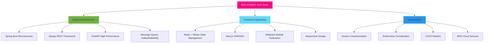

<div align="center">

# � BOLUO6868 | Code Architect

[](https://git.io/typing-svg)


</div>

---

## 💫 About Me

<details>
<summary>👨‍💻 Click to view my tech profile</summary>

```python
class Developer:
    def __init__(self):
        self.name = "BOLUO6868"
        self.role = "Full Stack Architect"
        self.language_spoken = ["zh_CN", "en_US"]
        
    def get_skills(self):
        return {
            "languages": {
                "expert": ["Python", "Java", "JavaScript"],
                "proficient": ["HTML5", "CSS3", "SQL", "Bash"]
            },
            "frameworks": {
                "frontend": ["React", "Redux", "Next.js", "Webpack"],
                "backend": ["Spring Boot", "Django", "FastAPI", "Flask"],
                "testing": ["JUnit", "Pytest", "Jest", "Selenium"]
            },
            "databases": ["MySQL", "PostgreSQL", "MongoDB", "Redis", "Elasticsearch"],
            "devops": ["Docker", "Kubernetes", "Jenkins", "GitLab CI", "AWS", "Linux"],
            "architecture": ["Microservices", "RESTful API", "Event-Driven", "DDD"],
            "tools": ["Git", "Maven", "Gradle", "Nginx", "RabbitMQ", "Kafka"]
        }
    
    def get_current_status(self):
        return {
            "focus": "Building high-performance distributed systems",
            "learning": "Advanced System Design & Cloud Native Architecture",
            "interests": ["Performance Optimization", "Scalability", "Clean Code"],
            "available_for": "Challenging projects and collaboration"
        }

me = Developer()
print(me.get_skills())
```

</details>

---

## 🛠️ Tech Arsenal

<div align="center">

### 💻 Core Languages


### ⚛️ Frontend Mastery


### 🔥 Backend Powerhouse


### 🗄️ Database & Cache


### ☁️ DevOps & Cloud


### 🔧 Tools & More


</div>

---

## 📊 GitHub Analytics

<div align="center">


</div>

<div align="center">
  
</div>

---

## 🏆 GitHub Trophies

<div align="center">
  


</div>

---

## 🎨 Code Quality Metrics

<div align="center">

```python
# Performance Optimization Mindset
class CodeQuality:
    def __init__(self):
        self.metrics = {
            "code_coverage": "95%+",
            "response_time": "< 100ms",
            "uptime": "99.9%",
            "code_review": "Mandatory",
            "documentation": "Comprehensive",
            "refactoring": "Continuous"
        }
    
    def optimize(self, code):
        """Always seeking perfection"""
        return self.refactor(self.test(self.profile(code)))
```

</div>

---

## 🎯 Architecture & Design Patterns



## 💡 System Design Philosophy

<div align="center">

```ascii
╔══════════════════════════════════════════════════════════════╗
║                    DESIGN PRINCIPLES                         ║
╠══════════════════════════════════════════════════════════════╣
║  🎯 High Cohesion, Low Coupling                             ║
║  ⚡ Performance First, Optimize Everything                   ║
║  🔒 Security by Design, Never an Afterthought               ║
║  📈 Scalability from Day One                                 ║
║  🧪 Test-Driven Development (TDD)                            ║
║  📚 Clean Code, Self-Documenting                             ║
║  🔄 Continuous Integration & Deployment                      ║
╚══════════════════════════════════════════════════════════════╝
```

</div>

---

## 🔥 Coding Activity & Stats

<div align="center">

<!--START_SECTION:waka-->
<!--END_SECTION:waka-->


</div>

## 🏅 Achievements & Milestones

<div align="center">

| 🎯 Metric | 📊 Stats |
|-----------|----------|
| **Total Commits** |  |
| **Total PRs** |  |
| **Total Issues** |  |
| **Contributed to** |  |

</div>

---

## 💡 Random Dev Quote

<div align="center">


</div>

---

## 🤝 Connect With Me

<div align="center">

[](https://github.com/BOLUO6868)
[](https://linkedin.com/in/yourprofile)
[](https://twitter.com/yourhandle)
[](mailto:your.email@example.com)

</div>

---

<div align="center">

### 💭 Quote of the Day

*"Code is like humor. When you have to explain it, it's bad."* – Cory House

### 👀 Profile Views


### ⚡ Fun Fact

I can write a recursive function without Stack Overflow... most of the time 😄

---


**💻 "Talk is cheap. Show me the code."** - Linus Torvalds


</div>
