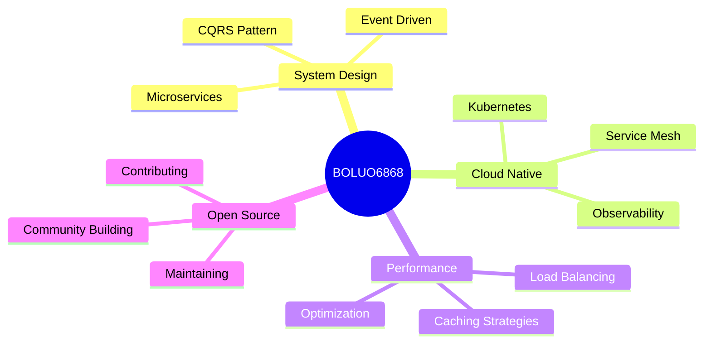

<div align="center">
  
# 🚀 Welcome to My Digital Universe

[](https://git.io/typing-svg)

</div>

---

## 💫 About Me

```typescript
const BOLUO6868 = {
    pronouns: "He" | "Him",
    code: ["TypeScript", "Python", "JavaScript", "Go", "Rust"],
    askMeAbout: ["web dev", "system design", "cloud architecture", "AI/ML"],
    technologies: {
        frontEnd: {
            js: ["React", "Next.js", "Vue", "Svelte"],
            css: ["Tailwind", "Styled-Components", "SASS"]
        },
        backEnd: {
            js: ["Node.js", "Express", "NestJS"],
            python: ["Django", "FastAPI", "Flask"],
            misc: ["GraphQL", "gRPC", "WebSocket"]
        },
        databases: ["PostgreSQL", "MongoDB", "Redis", "Elasticsearch"],
        devOps: ["Docker", "Kubernetes", "AWS", "GCP", "CI/CD"],
        tools: ["Git", "Vim", "Linux", "Nginx"],
        architecture: ["Microservices", "Event-Driven", "Serverless"]
    },
    currentFocus: "Building scalable distributed systems",
    funFact: "I debug with console.log and I'm not ashamed"
};
```

---

## 🛠️ Tech Arsenal

<div align="center">

### Languages


### Frontend


### Backend & Database


### DevOps & Tools


</div>

---

## 📊 GitHub Analytics

<div align="center">
  


</div>

---

## 🏆 GitHub Trophies

<div align="center">
  


</div>

---

## 📈 Contribution Graph

<div align="center">

[](https://github.com/BOLUO6868)

</div>

---

## 🎯 Current Focus



---

## 🔥 Recent Activity

<!--START_SECTION:activity-->
<!--END_SECTION:activity-->

---

## 💡 Random Dev Quote

<div align="center">


</div>

---

## 🤝 Connect With Me

<div align="center">

[](https://github.com/BOLUO6868)
[](https://linkedin.com/in/yourprofile)
[](https://twitter.com/yourhandle)
[](mailto:your.email@example.com)

</div>

---

<div align="center">

### 💭 Quote of the Day

*"Code is like humor. When you have to explain it, it's bad."* – Cory House

### 👀 Profile Views


### ⚡ Fun Fact

I can write a recursive function without Stack Overflow... most of the time 😄

---


**💻 "Talk is cheap. Show me the code."** - Linus Torvalds


</div>
